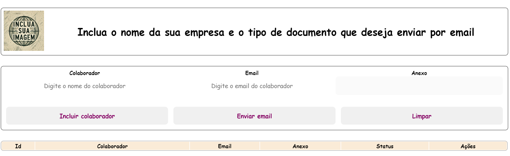

<p align="center"><a href="#"></a></p>

<p align="center">
<a href="https://www.npmjs.com/package/node"></a>
<a href="https://opensource.org/licenses/MIT"></a>
</p>

## Resumo da Aplicação

Esta é uma aplicação completa para **envio de emails em massa**, composta por um **frontend** desenvolvido em **React** e um **backend** desenvolvido em **Node.js**. A aplicação permite o cadastro de usuários e o envio de emails personalizados para cada um deles. O projeto é organizado e utiliza ferramentas modernas para garantir eficiência e escalabilidade.

---

## Backend

### Sobre o Projeto

Este é o backend da aplicação para envio de emails em massa, desenvolvido em Node.js v20.17.0.

### Recursos Principais

- Estrutura organizada utilizando o padrão **Controller-Service-Repository (CSR)**.
- Utilização do **Nodemailer** para envio eficiente de emails.
- Implementação de **Winston** para logs estruturados.
- Utilização do **UUID** para gerar identificadores únicos.
- Integração com **PDF.js** para manipulação de PDFs.

### Dependências

| Dependência                                        | Versão  |
| -------------------------------------------------- | ------- |
| [Express](https://expressjs.com/)                  | ^4.21.1 |
| [Cors](https://www.npmjs.com/package/cors)         | ^2.8.5  |
| [Dotenv](https://www.npmjs.com/package/dotenv)     | ^16.4.5 |
| [Nodemailer](https://nodemailer.com/)              | ^6.9.15 |
| [Nodemon](https://www.npmjs.com/package/nodemon)   | ^3.1.7  |
| [UUID](https://www.npmjs.com/package/uuid)         | ^10.0.0 |
| [Winston](https://www.npmjs.com/package/winston)   | ^3.15.0 |
| [PDF.js](https://www.npmjs.com/package/pdfjs-dist) | \*      |

### Estrutura do Projeto

```
db
controller
service
repository
routes
util
.env_exemplo.txt
.gitignore
app.js
package.json
package-lock.json
```

---

## Frontend

### Sobre o Projeto

Este é o frontend da aplicação para envio de emails em massa, desenvolvido em **React ^18.3.1**.

### Recursos Principais

- Estrutura organizada utilizando componentes reutilizáveis.
- Utilização do **Axios** para requisições HTTP.
- Implementação do **UUID** para gerar identificadores únicos.
- Gerenciamento eficiente de estados com hooks e contexto do React.

### Dependências

| Dependência                                                                            | Versão  |
| -------------------------------------------------------------------------------------- | ------- |
| [React](https://react.dev/)                                                            | ^18.3.1 |
| [Axios](https://axios-http.com/)                                                       | ^1.7.7  |
| [UUID](https://www.npmjs.com/package/uuid)                                             | ^10.0.0 |
| [React Testing Library](https://testing-library.com/docs/react-testing-library/intro/) | ^13.4.0 |
| [Jest DOM](https://github.com/testing-library/jest-dom)                                | ^5.17.0 |
| [React Scripts](https://www.npmjs.com/package/react-scripts)                           | 5.0.1   |
| [Web Vitals](https://web.dev/vitals/)                                                  | ^2.1.4  |

### Estrutura do Projeto

```
anexos
components
pages
utils
index.js
App.js
package.json
package-lock.json
.gitignore
```

### Imagem do Sistema

<p align="center">
  
</p>

## Como Executar o Projeto

Para que a aplicação funcione corretamente, as dependências devem ser instaladas tanto no **frontend** quanto no **backend**. Para isso, siga os passos abaixo em cada diretório correspondente.

1. No backend, execute:
   ```bash
   cd back_end
   npm install
   ```
2. No frontend, execute:
   ```bash
   cd front_end
   npm install
   ```
3. Para rodar o backend:
   ```bash
   npm start
   ```
4. Para rodar o frontend:
   ```bash
   npm start
   ```

## Autor

Desenvolvido por **IMoisasZ**
